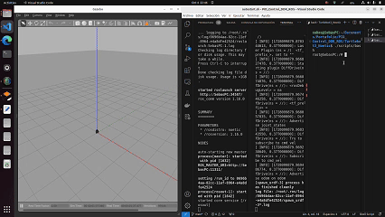
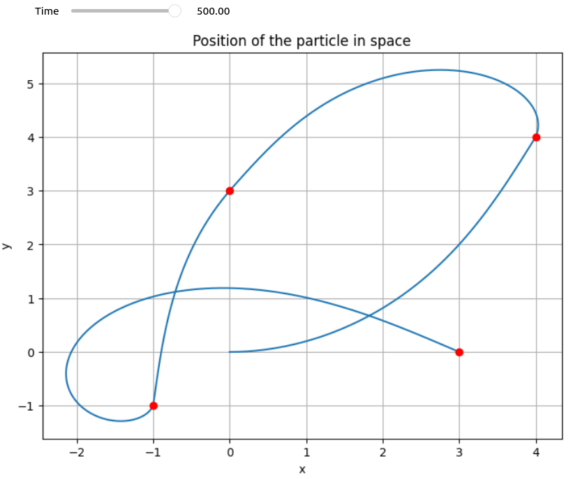
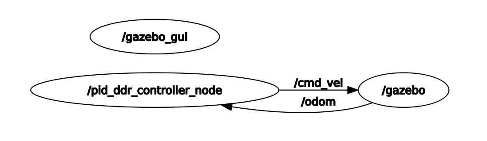

# PID Controller for Differential Drive Robot 

This repository contains a PID controller implementation and resources for running the TurtleBot3 robot with ROS Noetic in a Docker environment. The project includes simulations and real-world navigation using the PID control for differential drive robots.



## Summary of Key Components

### 1. PID_Controller.ipynb
The `PID_Controller.ipynb` notebook provides a detailed implementation of a Proportional-Integral-Derivative (PID) controller used to control a differential drive robot's motion. The notebook allows you to simulate the behavior of the PID controller by:

- Setting desired linear and angular velocities.
- Visualizing the robot’s path as it navigates towards a goal.
- Tuning PID parameters (Kp, Ki, Kd) to optimize performance.

This notebook is especially useful for understanding the theory behind PID control, visualizing the system’s response, and experimenting with different control strategies in a simulated environment.



### 2. controller.py
The `controller.py` script implements the PID controller in a real or simulated TurtleBot3 environment. It:

- Subscribes to the `/odom` (odometry) topic in ROS to retrieve the robot’s current pose and velocity.
- Publishes velocity commands to the `/cmd_vel` topic, controlling the robot's motion based on real-time feedback from the PID controller.
- Continuously adjusts the robot's trajectory to minimize the error between the current position and the desired target.

The script is designed for deployment in a ROS-based environment, making it suitable for real-world robot navigation or simulations. The PID gains can be modified within the script to fine-tune the control behavior.




## Setup Instructions

### Docker Environment

To run the TurtleBot3 environment in a Docker container, follow the steps below:

1. **Build the Docker Image:**  
   Navigate to the Turtlebot3_Noetic directory and run the build script:
   ```bash
   cd Turtlebot3_Noetic
   ./scripts/build
2. **Run the Docker Container:**

    Once the image is built, run the container using:
    ```bash
    ./scripts/run_nvidia
3. **Access the Docker Container:**
    Open another terminal and get inside the container:
    ```bash
     ./scripts/bash
### Launching the ROS Environment
1. **Launch an Empty World:**  
   In the container, launch an empty world for TurtleBot3 using:
   ```bash
   roslaunch turtlebot3_gazebo turtlebot3_empty_world.launch
2. **Running the PID Controller**

    In another terminal within the container, run the PID controller:
    ```bash
    rosrun pid_ddr_controller controller.py
